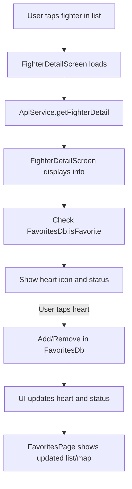

# UFC Flutter App: Detailed Codebase & Data Flow Documentation

This document explains every file in the `lib/` directory, their purpose, and—most importantly—how data and user actions flow through the app for each major feature. It is written for clarity and onboarding.

---

## Table of Contents

1. [App Structure Overview](#app-structure-overview)
2. [File-by-File Purpose](#file-by-file-purpose)
3. [Feature Data Flows](#feature-data-flows)
    - [A. Viewing Divisions and Fighters](#a-viewing-divisions-and-fighters)
    - [B. Viewing Fighter Details](#b-viewing-fighter-details)
    - [C. Favoriting/Unfavoriting a Fighter](#c-favoritingunfavoriting-a-fighter)
    - [D. Viewing Favorites and Map](#d-viewing-favorites-and-map)
    - [E. Viewing Rankings](#e-viewing-rankings)
4. [Model and Service Relationships](#model-and-service-relationships)
5. [Navigation and UI Structure](#navigation-and-ui-structure)

---

## App Structure Overview

- **main.dart**: Entry point, sets up the app and theme.
- **models/**: Data structures for fighters, rankings, champions, and favorites.
- **services/**: Handles API requests and local database (favorites).
- **pages/**: All UI screens, including navigation, lists, details, and favorites.

---

## File-by-File Purpose

### main.dart
- Starts the app and shows `GenderSelectionScreen` (the main tabbed navigation page).

### models/
- **favorite_fighter.dart**: Structure for a locally saved favorite fighter (id, name, image, birthplace).
- **fighter_detail.dart**: Full details for a fighter (stats, birthplace, etc).
- **fighter_summary.dart**: Minimal info for a fighter (id, name) for lists.
- **champion.dart**: Info about a division's champion.
- **ranking.dart**: Represents a division or ranking category (id, name, champion, fighters).

### services/
- **api_service.dart**: Fetches data from the Octagon API (rankings, divisions, fighter details).
- **favorites_db.dart**: Manages local SQLite database for favorites (add, remove, check, list).

### pages/
- **gender_selection_screen.dart**: Main navigation with bottom tabs for Men's, Women's, Rankings, Favorites.
- **weight_classes_screen.dart**: Lists all divisions for the selected gender.
- **fighter_list_screen.dart**: Lists all fighters in a division.
- **fighter_detail_screen.dart**: Shows detailed info, map, and favorite button for a fighter.
- **ranking_screen.dart**: Shows pound-for-pound rankings for men and women.
- **favorites_page.dart**: Shows all favorite fighters and a map of their birthplaces.

---

## Feature Data Flows

### A. Viewing Divisions and Fighters

**Goal:** User browses divisions and sees a list of fighters in a division.

**Step-by-step:**
1. **User opens the app** → `main.dart` shows `GenderSelectionScreen`.
2. **User taps a tab** (Men's or Women's Divisions) → `WeightClassesScreen` is shown.
3. `WeightClassesScreen` calls `ApiService.getRankings()` to fetch all divisions from the API.
4. The list is filtered by gender and displayed.
5. **User taps a division** → `FighterListScreen` is shown for that division.
6. `FighterListScreen` calls `ApiService.getDivision(divisionId)` to fetch all fighters in that division.
7. Fighters are displayed in a list.
8. **User taps a fighter** → `FighterDetailScreen` is shown for that fighter.

**Files involved:**
- `main.dart`, `gender_selection_screen.dart`, `weight_classes_screen.dart`, `fighter_list_screen.dart`, `api_service.dart`, `models/ranking.dart`, `models/fighter_summary.dart`, `models/champion.dart`

---

### B. Viewing Fighter Details

**Goal:** User sees detailed info, stats, and birthplace map for a fighter.

**Step-by-step:**
1. **User taps a fighter** in any list → `FighterDetailScreen` is shown.
2. `FighterDetailScreen` calls `ApiService.getFighterDetail(fighterId)` to fetch full details.
3. The screen displays:
    - Fighter's name, nickname, stats, etc.
    - Fighter's image (with CORS proxy on web)
    - Fighter's birthplace (geocoded to coordinates)
    - A map (using `flutter_map` and OpenStreetMap) with a marker at the birthplace
    - Favorite button (heart icon) and favorite status text
4. The screen also checks local favorites using `FavoritesDb.isFavorite(fighter.name)` to show the correct heart icon and status.

**Files involved:**
- `fighter_detail_screen.dart`, `api_service.dart`, `models/fighter_detail.dart`, `favorites_db.dart`, `models/favorite_fighter.dart`

---

### C. Favoriting/Unfavoriting a Fighter

**Goal:** User can add or remove a fighter from their favorites.

**Step-by-step:**
1. **User taps the heart icon** in `FighterDetailScreen`.
2. If not a favorite:
    - A `FavoriteFighter` object is created from the current fighter's details.
    - `FavoritesDb.addFavorite(favoriteFighter)` is called, saving it to SQLite.
3. If already a favorite:
    - `FavoritesDb.removeFavorite(fighter.name)` is called, removing it from SQLite.
4. The UI updates the heart icon and status text accordingly.

**Files involved:**
- `fighter_detail_screen.dart`, `favorites_db.dart`, `models/favorite_fighter.dart`

---

### D. Viewing Favorites and Map

**Goal:** User sees a list of all favorite fighters and a map of their birthplaces.

**Step-by-step:**
1. **User taps the Favorites tab** in the bottom navigation bar.
2. `FavoritesPage` calls `FavoritesDb.getFavorites()` to load all favorites from SQLite.
3. The list of favorites is displayed (name, image, etc).
4. **User taps "Show Map" button:**
    - For each favorite, the `placeOfBirth` is geocoded to coordinates (using Nominatim API).
    - A map is shown with a marker for each favorite's birthplace.
    - Geocoding results and errors are displayed for debugging.

**Files involved:**
- `favorites_page.dart`, `favorites_db.dart`, `models/favorite_fighter.dart`

---

### E. Viewing Rankings

**Goal:** User sees pound-for-pound rankings for men and women.

**Step-by-step:**
1. **User taps the Rankings tab** in the bottom navigation bar.
2. `RankingScreen` is shown, with a `TabBar` for Men and Women.
3. For each tab, `_P4PRankingList` calls `ApiService.getRankings()` to fetch all rankings.
4. The correct P4P ranking is selected and displayed as a list.
5. **User taps a fighter** in the list → navigates to `FighterDetailScreen` for that fighter.

**Files involved:**
- `ranking_screen.dart`, `api_service.dart`, `models/ranking.dart`, `models/fighter_summary.dart`, `fighter_detail_screen.dart`

---

## Model and Service Relationships

- **ApiService**: Central for all remote data. Returns model objects (`Ranking`, `FighterDetail`, etc) parsed from API JSON.
- **FavoritesDb**: Central for all local favorite storage. Stores and retrieves `FavoriteFighter` objects.
- **Model files**: Used throughout the app to pass structured data between services and UI.

---

## Navigation and UI Structure

- **main.dart** → `GenderSelectionScreen` (tabbed navigation)
- **Tabs:**
    - Men's Divisions → `WeightClassesScreen` → `FighterListScreen` → `FighterDetailScreen`
    - Women's Divisions → `WeightClassesScreen` → `FighterListScreen` → `FighterDetailScreen`
    - Rankings → `RankingScreen` → `FighterDetailScreen`
    - Favorites → `FavoritesPage`
- **Navigation** is handled with Flutter's `Navigator` and the bottom tab bar.

---

## Example: Full Data Flow for Favoriting a Fighter

1. User navigates to a fighter's detail page (`FighterDetailScreen`).
2. The screen fetches fighter details from the API and checks if the fighter is already a favorite in the local database.
3. User taps the heart icon:
    - If not a favorite, the fighter is added to the local database as a `FavoriteFighter`.
    - If already a favorite, the fighter is removed from the local database.
4. The UI updates instantly to reflect the new favorite status.
5. When the user visits the Favorites tab, the list and map are updated to show the current favorites and their birthplaces.

---

## Visual Diagram: Data Flow for Viewing and Favoriting a Fighter

---

## Summary

- The app is modular, with clear separation between data models, services, and UI pages.
- All remote data comes from `ApiService` and is parsed into models.
- All local favorite data is managed by `FavoritesDb`.
- Navigation is intuitive, with a bottom tab bar and clear flows for each feature.
- The documentation above should help any developer quickly understand and extend the app. 